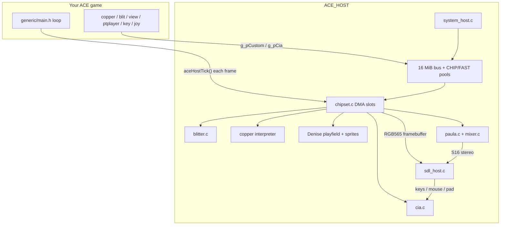

# ACE_HOST

ACE_HOST is the **Windows port of ACE**: the same copper, blit, extview,
viewport, sprite, and ptplayer sources that run on a real Amiga compile as a
native Windows executable. A software Agnus / Denise / Paula / CIA stands in
for `$DFF000`, and SDL presents video, audio, and input.

That is the point of the backend — **ship an ACE game on Windows** from the
same codebase, and **develop on Windows** without a cross-compiler or UAE for
every tweak. Linux builds work the same way if you need them.

It is **not** a full Amiga emulator. There is no 68000, no Kickstart, no floppy
trackdisk, and no Workbench. ACE still compiles as if `AMIGA` is defined; the
host supplies the chipset, a 16 MiB bus window, Exec/DOS stubs, and an SDL
window that presents Denise’s RGB565 framebuffer.

Short build notes also live in [`host/README.md`](../../host/README.md) and
[`host/BUILD.txt`](../../host/BUILD.txt). This page is the full reference.

---

## Who, what, where, when, why

| | |
| --- | --- |
| **What** | A CMake build mode (`-DACE_HOST=ON`) plus the `host/` tree: a DMA-slot Agnus, copper, blitter, playfield/sprites, Paula audio, CIA timers/keyboard, CHIP/FAST allocators, and SDL video/audio/input. The game stays ACE; only the chipset and OS glue change. |
| **Why** | Port existing ACE games to Windows (and optionally Linux) without rewriting copper, blits, or playfields. Also: develop and debug on the PC — CHIP/FAST budgets, DMA load, headless CI — then keep one source tree for Amiga and Windows. |
| **Who** | Authors porting an ACE game to Windows, and anyone developing that game (or ACE itself) on a PC. Players run the packaged `dist/` zip (`exe` + `SDL2.dll` + `data/`). |
| **Where** | Source in `host/`. Public headers in `host/include/` (NDK-shaped stubs) and `host/include/ace_host/`. Wired from the ACE root [`CMakeLists.txt`](../../CMakeLists.txt) when `ACE_HOST` is ON. Showcase example and Windows dist recipe: [`showcase/`](../../showcase/). |
| **When** | When you want a Windows build of the game, and throughout day-to-day development on PC. Leave `ACE_HOST` off for Amiga cross-compiles. Without either `AMIGA` (toolchain) or `ACE_HOST=ON`, CMake errors. |

---

## Mental model

On Amiga, ACE pokes `g_pCustom` at `$DFF000`, waits on `dmaconr` BBUSY, and
lets Agnus steal CHIP cycles for copper / bitplanes / blitter / audio / sprites.

On host, ACE still pokes `g_pCustom` — but that pointer is a `struct Custom`
mapped into a **16 MiB low-4GB bus window** at offset `$DFF000`. A software
chipset walks **227 color clocks (CCK) per scanline × 313 PAL lines** (or 263
NTSC), filling DMA slots the way Agnus does. Pixel work for a blit is applied
immediately; BBUSY still occupies leftover slots so copper waits and blit-hog
timing stay meaningful.



Both `AMIGA` and `ACE_HOST` are defined. Native Amiga sources stay in play;
`src/ace/managers/system.c` is excluded and replaced by `host/src/system_host.c`.

---

## How it works

### Boot sequence

`ace/generic/main.h` still calls `systemCreate()` first. On host that is
`host/src/system_host.c`:

1. **Crash handler** (`host/src/debug/crash.c`) — Windows SEH dump + optional `addr2line`.
2. **Memory** (`aceHostMemInit`) — map the 16 MiB bus, CHIP pool at offset 0, FAST per machine preset.
3. **Chipset** (`chipsetInit`) — bind `g_pCustom` / `g_pCia[]` into the bus, reset DMACON/INTENA, start copper halted.
4. **GfxBase stub** — enough of graphics.library for `copinit` / `WaitTOF` / `AllocBitMap`.
5. **SDL** (`aceHostSdlInit`) — window, RGB565 texture, 44.1 kHz audio (unless `ACE_HOST_HEADLESS`).
6. **Chipset thread** (`chipsetStartThread`) — background Agnus walking one scanline at a time, paced to 50/60 Hz.

Then ACE’s usual `logOpen` → `memCreate` → `timerCreate` → `blitManagerCreate` →
`copCreate` → your `genericCreate()`.

Each main-loop iteration, after `genericProcess()`, **`aceHostTick()`** waits
for the next vblank, presents the framebuffer, pumps SDL, and applies input.
If you write a custom `main()` and skip `generic/main.h`, you must call
`aceHostTick()` yourself (or `chipsetWaitVblank()` / `WaitTOF()`).

Shutdown is the reverse: `aceHostSdlShutdown`, `chipsetShutdown`, `aceHostMemShutdown`.

### The 16 MiB bus

| Offset | What |
| --- | --- |
| `$000000` | CHIP RAM (size from machine preset, Agnus hard cap 2 MiB) |
| `$BFE001` | CIA-A |
| `$BFD000` | CIA-B |
| `$C00000` | Trapdoor FAST on A500 512/512 (inside the window) |
| `$DFF000` | `struct Custom` (Denise/Agnus/Paula registers) |

CHIP DMA pointers are 32-bit host pointers into that mapping. Copper MOVE of a
pointer register writes the high/low 16-bit halves in Amiga order. Chip memory
is stored **big-endian** (the blitter and copper read bytes `[0]<<8 | [1]`),
matching Amiga `.bm` / copperlist layout even on a little-endian PC.

FAST RAM is a separate pool. On A500 512/512 it sits at `$C00000` inside the
window; on A1200+ it is a second low-4GB mapping. DMA (bitplanes, copper,
blitter, Paula, sprites) **only** accepts CHIP addresses — a non-CHIP pointer
is skipped with a one-shot stderr warning.

`AllocMem` / `FreeMem` / `AvailMem` / `TypeOfMem` are real. On MinGW/Linux,
`malloc` / `calloc` / `realloc` / `free` / `strdup` are `--wrap`’d so libc
allocations also come from `AllocMem(MEMF_ANY)` and count against CHIP/FAST.
SDL is pointed at the real OS heap (`SDL_SetMemoryFunctions`) so the window
does not eat your CHIP budget.

### Machine presets and memory modes

Set with `-DACE_HOST_MACHINE=...` (empty = `A500_512_512`, or `A1200` if
`ACE_USE_AGA_FEATURES` is on).

| Preset | CHIP | FAST |
| --- | --- | --- |
| `A500` | 512K | 0 |
| `A500_512_512` | 512K | 512K (trapdoor) |
| `A500_1MB` | 1M | 0 |
| `A600` | 1M | 0 |
| `A1200` | 2M | 0 |
| `A1200_4MB` | 2M | 4M |
| `A1200_8MB` | 2M | 8M |
| `A4000` | 2M | 4M |
| `CUSTOM` | `ACE_HOST_CHIP_SIZE` / `ACE_HOST_FAST_SIZE` bytes (CHIP defaults to 512K if 0) |

**STRICT** (default): `AllocMem` fails when the pool is exhausted — same class
of failure as a real machine.

**VIRTUAL** (`-DACE_HOST_MEM_MODE=VIRTUAL`): the pool can grow (CHIP still
capped at 2 MiB). Crossing the original budget prints
`[ACE_HOST] OVER-BUDGET` and lights the HUD banner. Use this to find how much
RAM a scene actually needs, then switch back to STRICT (or a larger preset).

Startup logs a line like:

```text
[ACE_HOST] machine A500_512_512  CHIP 512K  FAST 512K  STRICT  bus=0x...
```

### DMA-slot Agnus (`host/src/chipset/chipset.c`)

One **slot** = one color clock. PAL: 227 slots × 313 lines ≈ 50 Hz.
NTSC: 227 × 263 ≈ 60 Hz.

Priority on each slot (first match wins):

1. **Refresh** — even slots `h <= 6`
2. **Audio** — `h` in `$0D,$0F,$11,$13` if that AUDx DMA bit is on
3. **Sprites** — `h` in `$15..$24` from line 25 (HRM first sprite DMA line)
4. **Bitplane** — inside DDF, aligned to fetch period (lores 8 CCK, hires 4; AGA FMODE widens this)
5. **Copper remainder** — second CCK of a 2-slot instruction
6. **Copper** — MOVE / WAIT / SKIP / terminate (`$FFFF,$FFFE`)
7. **Blitter** — leftover slots while BBUSY, subject to `DMAF_BLITHOG`
8. **CPU** — a slot the blitter yielded (nothing else can claim it)

`DMAF_BLITHOG` (a.k.a. `DMAF_BLITPRI`/BLTPRI) arbitrates the blitter against the
CPU only; the copper outranks the blitter whether the bit is set or not. Set, the
blitter takes every slot the higher-priority channels left. Clear, Agnus lets the
CPU in for one cycle once it has been denied the bus three cycles running, so the
blitter drops one slot in four during a long blit. Game code never runs on an
emulated 68000 here, so that yielded slot is simply left free — but it still
stretches BBUSY, which is what `blitWait()` and copper blitter-WAITs observe.
Managers that set the bit deliberately (`tileBufferRedrawAll`) therefore finish
their blits in fewer scanlines than with it clear, as on real hardware.

Denise paints 2 lores (pixel-doubled to 640) or 4 hires pixels per slot into a
640-wide RGB565 framebuffer (256 PAL / 200 NTSC visible rows after DIWSTRT).

CPU writes to strobe registers (`BLTSIZE`, `BLTSIZH`, `COPJMP1/2`, `DMACON`,
`INTENA`, `INTREQ`) are **latched**. `chipsetSyncCpuWrites()` applies them
before the next slot batch. ACE managers that write COLOR under AGA also call
it explicitly so LOCT high/low nibbles are not lost.

The register file is plain memory, so the host cannot trap a write — it polls.
Normal blit code is safe because it opens with `blitWait()`, which flushes the
previous strobe. Code that starts a blit and then sets up the next one *without*
waiting (the `TILEBUFFER_REDRAW_HOG` tile draw) must call `blitStrobeSync()`
right after writing `BLTSIZE`, or the following BLTAPT/BLTDPT write replaces a
blit that never ran — the tiles vanish and destination-pointer chaining drifts.
The macro is a no-op on Amiga, where Agnus latches BLTSIZE immediately.

A background **chipset thread** (SDL) advances one scanline per loop and sleeps
to 50/60 Hz. The game thread must not present from that thread — SDL is only
touched on the game thread at vblank (`aceHostOnVblank`).

### Copper

Same ACE copper manager. On host, copper instructions are stored as **big-endian
bytes** (`copSetWait` / `copSetMove` in `include/ace/managers/copper.h`) so the
interpreter matches Amiga memory layout. Block sort uses Y then X, not the
`ulYX` overlay (which is endian-dependent).

WAIT compares V/H against the live beam, including the blitter-busy bit unless
the WAIT ignore-blit flag is set. COPJMP1 at vblank line 0 restarts COP1LC.
A MOVE to a pointer register stitches 16-bit halves into a 32-bit CHIP address.

### Blitter (`host/src/chipset/blitter.c`)

Triggered by `BLTSIZE` (OCS) or `BLTSIZH`/`BLTSIZV` (ECS). Pixel work
(standard A/B/C/D minterm blit, descending, exclusive fill, line mode) runs
**immediately**. `s_busy` / slot count still occupy DMA so `blitWait()` and
copper WAITs see realistic BBUSY.

`blitWait()` on host calls `chipsetWaitBlit()`, which finishes remaining slots
on the game thread instead of yielding to the 50 Hz chipset thread (a
`SDL_Delay(0)` on Windows can be ~15 ms and would turn a checkerboard of
`blitRect` into tens of seconds).

Starting a blit while the previous one still owes slots (the hog path does this
every tile, since the native CPU never gets throttled) **adds** to the pending
count rather than replacing it, so BBUSY and the HUD `BLIT` counter still add up
to what the bus would really have cost.

Mixed interleaved/non-interleaved copies that would be painful on real hardware
are done with a host `memcpy` helper for cookie/copy minterms when 16-pixel
aligned — the Amiga path still warns.

### Playfield and sprites (Denise)

- Depth from BPLCON0 (OCS/ECS up to 6, AGA up to 8 including BPU3).
- DDFSTRT/STOP, BPL1MOD/BPL2MOD, BPLCON1 scroll delay (AGA extra bits).
- Extra-half-bright when 6 planes and HAM/EHB bits allow it.
- AGA: FMODE fetch size, BPLCON3 bank/LOCT colors, BPLCON4 XOR / sprite bank.
- Eight hardware sprites, attach, chained VSTOP fetch, AGA wide sprites via FMODE.

The window is **4:3 CRT** (640×480 unit, integer scale, nearest-neighbor) so
lores columns stay 1:1 or 2:1 instead of a screen-door stretch of 640×256.

### Paula and the software mixer

Paula (`host/src/chipset/paula.c`) DMA-fetches 8-bit samples on audio slots, applies
period/volume, and mixes into an SDL callback (S16 stereo, typically 44100 Hz).
AUDx interrupts are dispatched **immediately** when a sample ends so ptplayer
one-shot SFX do not loop for a whole frame.

`host/src/mixer/mixer.c` is a host port of the typical Amiga software mixer API
(`MixerSetup`, `MixerPlaySample`, …). By default it owns **AUD3**
(`ACE_HOST_MIXER_HW=8`), mixing `ACE_HOST_MIXER_SW_CHANNELS` (default 3)
software voices into that hardware channel at period 161.

### CIA, keyboard, joystick

CIA-A/B timers tick every **5 CCK** (E-clock). Keyboard goes through CIA-A SDR
plus the SPMODE handshake so ACE `key.c` `onKeyInterrupt` runs, including the
3-scanline wait via `getRayPos()`.

SDL scancodes map to Amiga raw keys. Arrow keys are CIA keys so menu
`keyUse || joyUse` does not double-step when a virtual stick is also on.

| Host input | Amiga |
| --- | --- |
| Keyboard | CIA-A SDR → `onKeyInterrupt` |
| Mouse motion | `JOY0DAT` (port 1) |
| LMB / RMB / MMB | CIA FIR0 / POTINP bits |
| Virtual joystick (optional) | numpad 8/4/6/2 + 5 or RCtrl → `JOY1DAT` + FIR1; first SDL GameController hot-plugs to the same port; pad B is fire 2 |

Enable virtual joystick with `-DACE_HOST_USE_VIRTUAL_JOYSTICK=ON`.

`getRayPos()` rebuilds `tRayPos.ulValue` from `vposr`/`vhposr` and uses an LE
bitfield overlay in `custom.h`, so `bfPosY` / `bfPosX` match Amiga numbering.

### Interrupts

`aceHostDispatchInts()`:

- **VERTB** always advances `timerOnInterrupt()` (even if INTENA only has INTEN), so `timerGet()` cannot freeze.
- **AUDx** runs the registered ACE handler even if INTEN was briefly cleared (ptplayer SFX).
- Other custom interrupts require INTEN + the channel bit + a `systemSetInt` handler.
- CIA timer underflows call `systemSetCiaInt` handlers and raise PORTS/EXTER.

### Little-endian and host `#ifdef`s

Host is almost always LE; Amiga is BE. The important patches:

| Area | Host difference |
| --- | --- |
| Copper insns | Written as BE bytes, not bitfields |
| Copper block sort | Compare `uwY` then `uwX` |
| `tRayPos` | LE overlay of `(vposr<<16)\|vhposr` |
| Sprite header bitfields | `unsigned short` packing |
| CHIP RAM / copper DMA | Always BE 16-bit words |
| `endianBig16/32` | Swap on host (`endian.h` treats ACE_HOST like a LE machine) |
| `REGPTR` | Not `* const` — `g_pCustom` is bound after the bus exists |
| Tags | `tTag` is `uintptr_t` so 64-bit hosts can pass pointers in taglists |
| `CHIP` / `FAR` / `INTERRUPT` | No-ops (`include/ace/types.h`) |

Game code that assumes `ulYX` numeric order or overlays `vposr` as a BE long
needs the same care as ACE’s own managers.

### Exec / DOS / graphics stubs

`host/include/` mimics enough NDK headers that ACE sources compile:
`proto/exec.h`, `hardware/custom.h`, `graphics/gfx.h`, CIA, DOS locks, etc.

Implemented in `system_host.c` / `memory.c` / `host_os.c`:

- `AllocMem` / `FreeMem` / `AvailMem` / `CopyMem`
- `OpenLibrary` / `OpenResource` / `Forbid` / `Permit` / `Disable` / `Enable`
- `AllocBitMap` / `FreeBitMap` / `WaitTOF` / `LoadRGB4` / `WaitBlit` / `OwnBlitter`
- `Lock` / `UnLock` / `Examine` / `ExNext` / `CreateDir` — real host directories

Not implemented: trackdisk, filesystems as Amiga volumes, intuition, audio.device
beyond Paula registers, a 68000.

---

## How to use it

Two jobs share this backend:

1. **Port the game to Windows** — one CMake option, same ACE sources, package
   `exe` + `SDL2.dll` + `data/` for players.
2. **Develop on Windows** — run, HUD, logs, and headless tests on the PC;
   cross-compile separately when you still ship Amiga.

### Dependencies

- CMake 3.14+
- A host C compiler: MSYS2 UCRT MinGW GCC, or MSVC; Linux GCC/Clang
- SDL2 (CMake `find_package(SDL2)` or FetchContent of SDL 2.30.8)

MSYS2 UCRT:

```text
pacman -S mingw-w64-ucrt-x86_64-gcc mingw-w64-ucrt-x86_64-SDL2 ninja
```

Point CMake at SDL2 with `-DCMAKE_PREFIX_PATH=C:/msys64/ucrt64`.

### Build the showcase

From the ACE repo root:

```sh
cmake -S showcase -B build-host -G Ninja -DACE_HOST=ON -DACE_DEBUG=ON -DCMAKE_PREFIX_PATH=C:/msys64/ucrt64
cmake --build build-host --parallel
cd build-host && ./showcase.exe
```

Run **from the build directory** so `data/` is found.

Asset conversion (fonts / palettes / bitmaps) runs only if ACE tools exist in
`tools/bin/`:

```sh
cmake -S tools -B tools/build-host -G Ninja
cmake --build tools/build-host --parallel
```

Then reconfigure and rebuild showcase.

Distribute folder (Release, SDL2.dll, `data/`, zip):

```sh
cmake -S showcase -B build-host-dist -G Ninja -DACE_HOST=ON -DACE_DEBUG=OFF -DCMAKE_BUILD_TYPE=Release -DCMAKE_PREFIX_PATH=C:/msys64/ucrt64
cmake --build build-host-dist --target dist --parallel
```

Output: `dist/showcase-host/` and `dist/showcase-host.zip` — that folder is
what you give Windows players (see `showcase/README-HOST-DIST.txt`).

Amiga cross-builds are unchanged: omit `ACE_HOST` and pass the m68k toolchain
as in [Building ACE](../installing/ace.md).

### Port an existing ACE game

Most games need little more than the CMake switch. Keep `#ifdef AMIGA` blocks
— they are true on host as well. Use `#ifndef ACE_HOST` only for things that
are truly 68000/UAE-only (supervisor stack tricks, poking `$f0ff60`, inline
asm).

Typical port work:

- Add the `ACE_HOST` option and host include / malloc-wrap / `SDL2main` lines
  below (same pattern as showcase).
- Older loaders (`bitmapCreateFromFile`, `paletteLoad`, …) can
  `-include ace/compat.h` on the **game** target, not when compiling ACE.
- Replace or stub 68000 asm and UAE-only debug.
- Watch endian overlays (`ulYX`, raw `vposr` as a BE long) — ACE’s managers
  already do; custom copper/sprite packing may need the same.
- Pick `ACE_HOST_MACHINE` to match the Amiga you designed for (CHIP/FAST
  budgets still apply). `VIRTUAL` is useful while hunting leaks; ship
  `STRICT` so Windows players hit the same cap.
- Package like showcase `dist`: exe, `SDL2.dll`, `data/`, a short README.

### Hook it into your game

Same pattern as showcase:

```cmake
option(ACE_HOST "Build with ACE host SDL chipset backend" OFF)

if(NOT AMIGA AND NOT ACE_HOST)
	message(SEND_ERROR "This project only compiles for Amiga (or ACE_HOST=ON)")
endif()

if(ACE_HOST)
	set(CMAKE_C_FLAGS "${CMAKE_C_FLAGS} -DAMIGA -DACE_HOST")
endif()

add_subdirectory(deps/ace)   # or wherever ACE lives
target_link_libraries(myGame ace)

if(ACE_HOST)
	target_include_directories(myGame PRIVATE ${ACE_DIR}/host/include)
endif()

if(ACE_HOST AND NOT MSVC AND NOT APPLE)
	target_link_options(myGame PRIVATE
		"LINKER:--wrap,malloc" "LINKER:--wrap,calloc"
		"LINKER:--wrap,realloc" "LINKER:--wrap,free"
		"LINKER:--wrap,strdup" "LINKER:--wrap,_strdup"
		"LINKER:--wrap,_msize"
	)
endif()

if(ACE_HOST AND TARGET SDL2::SDL2main)
	target_link_libraries(myGame SDL2::SDL2main)
endif()
```

Use `ace/generic/main.h` so `aceHostTick()` is called for you. A custom `main()`
must call it each frame (or `WaitTOF()` / `chipsetWaitVblank()`).

### CMake flags

| Flag | Default | Meaning |
| --- | --- | --- |
| `ACE_HOST` | OFF | Enable the host backend |
| `ACE_HOST_MACHINE` | empty → A500_512_512 (or A1200 if AGA) | Memory preset |
| `ACE_HOST_MEM_MODE` | STRICT | STRICT or VIRTUAL |
| `ACE_HOST_CHIP_SIZE` / `ACE_HOST_FAST_SIZE` | 0 | CUSTOM machine sizes, bytes |
| `ACE_HOST_DEBUG` | ON | F11/F12 HUD |
| `ACE_HOST_USE_VIRTUAL_JOYSTICK` | OFF | Numpad / gamepad → JOY1 |
| `ACE_HOST_MIXER_SW_CHANNELS` | 3 | Software mixer voices |
| `ACE_HOST_MIXER_PERIOD` | 161 | Paula period for the mix buffer |
| `ACE_HOST_MIXER_HW` | 8 (`DMAF_AUD3`) | Hardware channel the mixer owns |
| `ACE_DEBUG` | OFF | ACE log / blit range checks |
| `ACE_USE_AGA_FEATURES` | OFF | AGA copper/playfield/sprites + A1200 default machine |

Host-relevant ACE flags (`ACE_USE_ECS_FEATURES`, tilebuffer, bob wrap, …) still
apply; they compile into the same managers.

### Environment variables

Set in the shell before launching the exe.

| Variable | Effect |
| --- | --- |
| `ACE_HOST_HEADLESS=1` | No SDL window; implies no pacing. For CI. |
| `ACE_HOST_NOPACE=1` | Do not sleep to 50/60 Hz (run as fast as the chipset thread allows). |
| `ACE_HOST_QUIT_AFTER=N` | `gameExit()` after N vblanks. |
| `ACE_HOST_AUTO_KEY` | Inject a key on a given vblank (`return` / `space` / `escape` or a raw code). |
| `ACE_HOST_AUTO_KEY_FRAME` | Vblank index for that key (default 10). Released two frames later. |
| `ACE_HOST_TIMING=1` | Log lines/frame, last copper WAIT Y, blit slots every ~50 frames. Also toggled with F10. |
| `ACE_HOST_DUMP_FB=N` | Write `host_fb.ppm` on vblank N and print the first lit row. |
| `ACE_HOST_TEST` | Showcase only: jump straight to a test (`menu`, `blit`, `copper`, … or a numeric index). |
| `ACE_HOST_ADDR2LINE` | Path to `addr2line` for Windows crash dumps (default MSYS2 UCRT). |

Example headless copper test for 200 frames:

```sh
set ACE_HOST_HEADLESS=1
set ACE_HOST_TEST=copper
set ACE_HOST_QUIT_AFTER=200
.\showcase.exe
```

### Runtime keys (host overlay)

These are consumed by SDL, not the Amiga keyboard:

| Key | Action |
| --- | --- |
| F10 | Toggle timing log to stderr |
| F11 | Toggle memory HUD (`ACE_HOST_DEBUG`) |
| F12 | Toggle full overlay: per-slot DMA colors + CHIP map + copper disasm |
| Close window | `systemKill("window closed")` |

Everything else is an Amiga key. Showcase: arrows/WASD move the menu, Return
selects, Escape goes back.

### Debug HUD

Needs `-DACE_HOST_DEBUG=ON` (the CMake default).

F11 line (abbreviated):

```text
A500_512_512 STRICT
CHIP 412/512K PK440K FR88K
FAST 120/512K PK120K FR390K
Y12 X40 DMA83F BIDLE COP00xxxxxx
LN313 CW44 BLIT1200 OK
```

- **LN313** — scanlines last frame (PAL must be 313).
- **CW** — last copper WAIT Y.
- **BLIT** — blitter DMA slots last frame.
- **OK / BAD** — slot/line counts matched the PAL/NTSC constants.

F12 paints the last scanline’s 227 DMA slots:

| Color | Channel |
| --- | --- |
| Grey | Refresh |
| Orange | Audio |
| Cyan | Sprite |
| Green | Bitplane |
| Magenta | Copper |
| Red | Blitter |
| Blue | CPU (slot the blitter yielded with BLITHOG clear) |

Over-budget (VIRTUAL) flashes `OVER BUDGET` in red.

### Logging and crashes

`logWrite` also `fputs` to stdout on host. `ACE_DEBUG_UAE` is a no-op (the host
must not poke emulator addresses).

On Windows, unhandled exceptions write a stack dump to stderr and
`ace_host_crash.txt`. Point `ACE_HOST_ADDR2LINE` at MinGW `addr2line` for
function/file/line.

`systemKill("...")` prints `[ACE_HOST] KILL: ...` and exits.

---

## Source map

| Path | Role |
| --- | --- |
| `host/src/system_host.c` | `systemCreate` / interrupts / Exec+graphics stubs |
| `host/src/chipset/chipset.c` | DMA slots, copper, Denise, vblank, `aceHostTick` |
| `host/src/chipset/blitter.c` | OCS/ECS blit + line mode |
| `host/src/chipset/cia.c` | CIA timers, keyboard queue, PRA fire |
| `host/src/chipset/paula.c` | Four DMA audio channels + mix ring |
| `host/src/chipset/memory.c` | CHIP/FAST pools, `AllocMem` |
| `host/src/chipset/stdlib_alloc.c` | wrapped `malloc` |
| `host/src/chipset/host_os.c` | low-4GB map, dirs, OS heap for SDL |
| `host/src/sdl/sdl_host.c` | Window, present, input, pacing, env vars |
| `host/src/mixer/mixer.c` | Software mixer onto one Paula channel |
| `host/src/debug/hud.c` | F11/F12 overlay |
| `host/src/debug/crash.c` | Windows crash dump |
| `host/include/` | NDK-shaped headers, `ace_host/`, `chipset_priv.h`, `host_os.h` |
| `src/ace/utils/custom.c` | Host `g_pCustom` bind, `getRayPos` |
| `include/ace/generic/main.h` | `aceHostTick()` in the generic loop |

---

## What it is not / known gaps

Windows (and Linux) are first-class ACE_HOST targets. The backend is still not
a cycle-accurate Amiga:

- **Not UAE / WinUAE / FS-UAE.** No 68000 cycle timing, no Kickstart, no disk
  DMA. A bug that is only 68000 alignment or instruction timing will not show
  up here — and does not matter for the Windows port.
- Disk DMA, copper skip edge cases, HAM, dual-playfield priority vs sprites,
  and some AGA FMODE combinations are simplified or unproven.
- `WaitBlit` completes pixel work immediately; only BBUSY slot occupancy is timed.
- Keyboard handshake advances the beam via `getRayPos()`; with the chipset
  thread asleep in its 50 Hz wait, SPMODE is the case that still steps slots
  so the 3-line wait can finish.
- Malloc wrapping is MinGW/Linux; MSVC does not wrap libc `malloc`.
- Without SDL2, the library still builds (`ACE_HOST_HAS_SDL` off) but there is
  no window or audio.

Keep an Amiga cross-build if you still ship on real hardware. The Windows
build does not replace that; it is the Windows game.

---

## Related docs

- [Building ACE](../installing/ace.md) — Amiga cross-compile (leave `ACE_HOST` off)
- [ACE in a nutshell](ace_in_a_nutshell.md) — managers vs utils
- [View & viewports](view.md)
- [Blitter](blit.md)
- [Working with and without OS](os.md)
- [AGA](aga.md)
- [Audio](audio.md)
